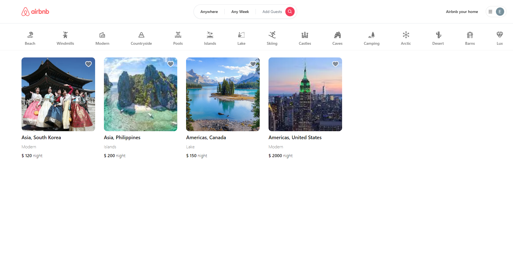
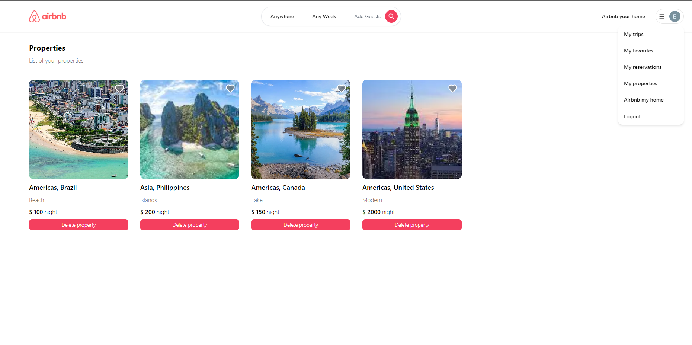
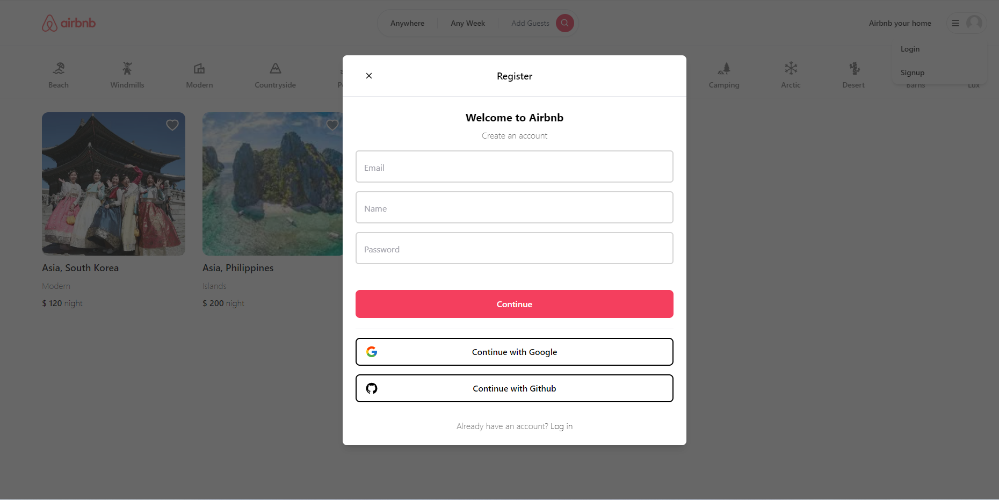

# Airbnb Clone

#### Airbnb clone is a full-stack app powered by Next.js, Prisma, MongoDB, and Typescript. In it, we can add your property, and book a trip that does not coincide with the dates already scheduled. We use the next/auth library itself for authentication with email and Google and GitHub providers, all integrated into a backend built with Prisma in the Next.js project connected to the MongoDB database.


### Home Screen

<div> 
  
</div>


### Properties Screen

<div> 
  
</div>


### Register Screen

<div> 
  
</div>


### Create Property

<div> 
  
</div>

### Detail Screen

<div> 
  
</div>

### Responsiveness

<div> 
  
</div>

## Getting Started

Install the dependencies and run the development server

```bash
npm install
npm run dev
```

### Technologies

##### - [NextJS](https://nextjs.org/)
##### - [Prisma](https://www.prisma.io/)
##### - [MongoDB](https://www.mongodb.com/atlas/database)
##### - [Tailwind css](https://tailwindui.com/)

